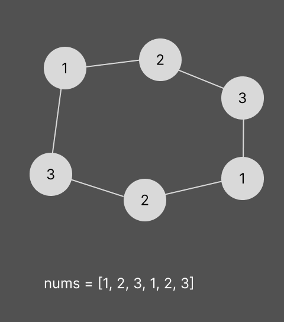

[problem list](../readme.md)

# Problem
https://leetcode.com/problems/house-robber-ii/

# Attempt
Dynamic programming, growing from left to right.

# Mistake attempt
Dynamic programming, growing in both directions.
Always calculating as elements would be cycled.
Which leads to mistakes in result when reusing previous results.

# More complex example

# Sketch of attempt
Sketch of calcutating from top to bottom.
With recursion and memoization.

# Solution

