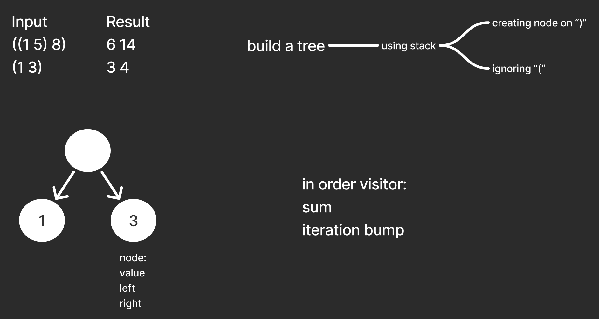

# Leet code solving

2560. House Robber IV
[2226. Maximum Candies Allocated to K Children](https://github.com/maciej-ka/eat-code?tab=readme-ov-file#2226-maximum-candies-allocated-to-k-children)  
[3356. Zero Array Transformation II](https://github.com/maciej-ka/eat-code?tab=readme-ov-file#3356-zero-array-transformation-ii)  
[2529. Maximum Count of Positive Integer and Negative Integer](https://github.com/maciej-ka/eat-code?tab=readme-ov-file#2529-maximum-count-of-positive-integer-and-negative-integer)  
[1358. Number of Substrings Containing All Three Characters](https://github.com/maciej-ka/eat-code?tab=readme-ov-file#1358-number-of-substrings-containing-all-three-characters)  
[3306. Count of Substrings Containing Every Vowel and K Consonants II](https://github.com/maciej-ka/eat-code?tab=readme-ov-file#3306-count-of-substrings-containing-every-vowel-and-k-consonants-ii)  
[3208. Alternating Groups II](https://github.com/maciej-ka/eat-code?tab=readme-ov-file#3208-alternating-groups-ii)  
[2379. Minimum Recolors to Get K Consecutive Black Blocks](https://github.com/maciej-ka/eat-code?tab=readme-ov-file#2379-minimum-recolors-to-get-k-consecutive-black-blocks)  
[2523. Closest Prime Numbers in Range](https://github.com/maciej-ka/eat-code?tab=readme-ov-file#2523-closest-prime-numbers-in-range)  
[2965. Find Missing and Repeated Values](https://github.com/maciej-ka/eat-code?tab=readme-ov-file#2965-find-missing-and-repeated-values)  
[2579. Count Total Number of Colored Cells](https://github.com/maciej-ka/eat-code?tab=readme-ov-file#2579-count-total-number-of-colored-cells)  
[1780. Check if Number is a Sum of Powers of Three](https://github.com/maciej-ka/eat-code?tab=readme-ov-file#1780-check-if-number-is-a-sum-of-powers-of-three)  
[2161. Partition Array According to Given Pivot](https://github.com/maciej-ka/eat-code?tab=readme-ov-file#2161-partition-array-according-to-given-pivot)  
[2570. Merge Two 2D Arrays by Summing Values](https://github.com/maciej-ka/eat-code?tab=readme-ov-file#2570-merge-two-2d-arrays-by-summing-values)  
[2460. Apply Operations to an Array](https://github.com/maciej-ka/eat-code?tab=readme-ov-file#2460-apply-operations-to-an-array)  
[1092. Shortest Common Supersequence](https://github.com/maciej-ka/eat-code?tab=readme-ov-file#1092-shortest-common-supersequence)  
[873. Length of Longest Fibonacci Subsequence](https://github.com/maciej-ka/eat-code?tab=readme-ov-file#873-length-of-longest-fibonacci-subsequence)  
[1749. Maximum Absolute Sum of Any Subarray](https://github.com/maciej-ka/eat-code?tab=readme-ov-file#1749-maximum-absolute-sum-of-any-subarray)  
[1524. Number of Sub-arrays With Odd Sum](https://github.com/maciej-ka/eat-code?tab=readme-ov-file#1524-number-of-sub-arrays-with-odd-sum)  
[3399. Smallest Substring With Identical Characters II](#3399-smallest-substring-with-identical-characters-ii)  
[347. Top K Frequent Elements](#347-top-k-frequent-elements)  
[2834. Find the Minimum Possible Sum of a Beautiful Array](#2834-find-the-minimum-possible-sum-of-a-beautiful-array)  
[Trick or Tree'ing](#trick-or-treeing)  
[213. House Robber II](#213-house-robber-ii)  
[31. Next Permutation](#31-next-permutation)

#### Random problem
https://leetcode.com/problemset/  
and click "pick one"

#### Random lang
Feeling in a polyprogramming mood?  
Randomly pick language on leetcode.
```bash
./random-lang
```

#### Running tests
```bash
# javascript
npm test

# go
go test

# elixir
mix test

# ruby
ruby ./test_solution.rb

# php
composer test

# c lang
# todo: check how to unit test
clang -Wall 1.c -o /tmp/minCost && /tmp/minCost

# swift
swift test
```


[2560. House Robber IV](https://leetcode.com/problems/house-robber-iv/description/)
===========================

### Javascript
Binary search the solution
Greedy test is solution ok
[solution](./2560/1-js/solution.js)  
[submission](https://leetcode.com/problems/house-robber-iv/submissions/1574015334/)  
85% (18ms)  
19% (64MB)


[2226. Maximum Candies Allocated to K Children](https://leetcode.com/problems/maximum-candies-allocated-to-k-children/description/)
===================================================

### Javascript
Since it's hard to solve, but easy to check is n a solution  
perform binary search on whole range.  
[solution](./2226/1-js/solution.js)  
[submission](https://leetcode.com/problems/maximum-candies-allocated-to-k-children/submissions/1573224630/)  
41% (42ms)  
29% (67MB)

### Javascript
Narrow search range by counting total number of candies,  
and assume the best scenario is to divide all of them equally  
[solution](./2226/2-js/solution.js)  
[submission](https://leetcode.com/problems/maximum-candies-allocated-to-k-children/submissions/1573245312/)  
100% (18ms)  
26% (68MB)


[3356. Zero Array Transformation II](https://leetcode.com/problems/zero-array-transformation-ii/description/)
========================================


### Javascript
Convert numbers to a difference array, as that way batch adding can be faster  
(by just modifying two values). Then binary search for solution, on each step:  
cloning diff array, applying queries and checking is step passing  
[solution](./3356/1-js/solution.js)  
[submission](https://leetcode.com/problems/zero-array-transformation-ii/submissions/1572410492/)  
88% (53ms)  
6% (110MB)

### Javascript
Shorten code for binary search, by introducing result variable  
[solution](./3356/2-js/solution.js)  
[submission](https://leetcode.com/problems/zero-array-transformation-ii/submissions/1572448442/)  
88% (35ms)  
6% (103MB)


[2529. Maximum Count of Positive Integer and Negative Integer](https://leetcode.com/problems/maximum-count-of-positive-integer-and-negative-integer/description/)
==================================================================

### Javascript
Binary search, used twice  
[solution](./2529/1-js/solution.js)  
[submission](https://leetcode.com/problems/maximum-count-of-positive-integer-and-negative-integer/submissions/1571119477/)  
100% (0ms)  
39% (53MB)


[1358. Number of Substrings Containing All Three Characters](https://leetcode.com/problems/number-of-substrings-containing-all-three-characters/description/)
================================================================

### Javascript
Sliding window with varying length.  
[solution](./1358/1-js/solution.js)  
[submission](https://leetcode.com/problems/number-of-substrings-containing-all-three-characters/submissions/1569983416/)  
81% (12ms)  
51% (55MB)

### Javascript
No sliding window, just one iteration.  
Identify minimal substring by tracking last positions of each character.  
Each prefix character before minimal substring increases result.  
[solution](./1358/2-js/solution.js)  
[submission](https://leetcode.com/problems/number-of-substrings-containing-all-three-characters/submissions/1570041471/)  
97% (7ms)  
51% (55MB)


[3306. Count of Substrings Containing Every Vowel and K Consonants II](https://leetcode.com/problems/count-of-substrings-containing-every-vowel-and-k-consonants-ii/description/)
==========================================================================

### Javascript
Sliding window with varying length.  
Long and error prone solution.  
But quite performant.  
[solution](./3306/1-js/solution.js)  
[submission](https://leetcode.com/problems/count-of-substrings-containing-every-vowel-and-k-consonants-ii/submissions/1569046722/)  
90% (246ms)  
20% (72MB)

### Javascript
Optimize by replacing vowels hash  
with dedicated variables  
[solution](./3306/2-js/solution.js)  
[submission](https://leetcode.com/problems/count-of-substrings-containing-every-vowel-and-k-consonants-ii/submissions/1569065998/)  
90% (169ms)  
20% (71MB)


[3208. Alternating Groups II](https://leetcode.com/problems/alternating-groups-ii/description/)
=================================

### Javascript
Calculate in one pass.  
Deal with cycles by extending last group.  
[solution](./3208/1-js/solution.js)  
[submission](https://leetcode.com/problems/alternating-groups-ii/submissions/1567908422/)  
75% (65ms)  
50% (65MB)

### Javascript
Optimize by extracting score method  
and cutting one conditional  
[solution](./3208/2-js/solution.js)  
[submission](https://leetcode.com/problems/alternating-groups-ii/submissions/1567933502/)  
100% (38ms)  
50% (65MB)


[2379. Minimum Recolors to Get K Consecutive Black Blocks](https://leetcode.com/problems/minimum-recolors-to-get-k-consecutive-black-blocks/description/)
==============================================================

### Javascript
Sliding window approach  
[solution](./2379/1-js/solution.js)  
[submission](https://leetcode.com/problems/minimum-recolors-to-get-k-consecutive-black-blocks/submissions/1566792368/)  
69% (1ms)  
22% (55MB)

### Javascript
Improve by using Math.max  
and storing precalculated loop end  
[solution](./2379/2-js/solution.js)  
[submission](https://leetcode.com/problems/minimum-recolors-to-get-k-consecutive-black-blocks/submissions/1566799941/)  
100% (0ms)  
20% (55MB)

### Go
Same approach  
[solution](./2379/3-go/solution.go)  
[submission](https://leetcode.com/problems/minimum-recolors-to-get-k-consecutive-black-blocks/submissions/1566845167/)  
100% (0ms)  
18% (4MB)

### Go
Improve memory by using `range k` syntax  
instead of traditional c-style for loop  
[solution](./2379/4-go/solution.go)  
[submission](https://leetcode.com/problems/minimum-recolors-to-get-k-consecutive-black-blocks/submissions/1566854407/)  
100% (0ms)  
73% (3.9MB)

### Swift
Same approach  
[solution](./2379/5-swift/Sources/Solution/Solution.swift)  
[submission](https://leetcode.com/problems/minimum-recolors-to-get-k-consecutive-black-blocks/submissions/1567443004/)  
100% (0ms)  
86% (19MB)


[2523. Closest Prime Numbers in Range](https://leetcode.com/problems/closest-prime-numbers-in-range/description/)
==========================================

### Javascript
First sieve for primes, using Uint8Array.  
Then walk range and keep track of best.  
[solution](./2523/2-js/solution.js)  
[submission](https://leetcode.com/problems/closest-prime-numbers-in-range/submissions/1566051005/)  
67% (173ms)  
11% (88MB)

### Javascript
Early break when distance is 2  
[solution](./2523/3-js/solution.js)  
[submission](https://leetcode.com/problems/closest-prime-numbers-in-range/submissions/1566075655/)  
78% (149ms)  
11% (89MB)


[2965. Find Missing and Repeated Values](https://leetcode.com/problems/find-missing-and-repeated-values/description/)
===========================================

### Javascript
Walk a grid and fill array of counts  
Then walk counts and fill result  
**For performance**  
Use `Uint8Array` as counts array.  
Avoid +/-1 index/number conversion by treating  
counts array as if it would be 1-indexed.  
[solution](./2965/1-js/solution.js)  
[submission](http://leetcode.com/problems/find-missing-and-repeated-values/submissions/1564779702/)  
99% (1ms)  
23% (57MB)

### Go
Same approach  
[solution](./2965/2-go/solution.go)  
[submission](https://leetcode.com/problems/find-missing-and-repeated-values/submissions/1566506700/)  
100% (0ms)  
56% (8MB)


[2579. Count Total Number of Colored Cells](https://leetcode.com/problems/count-total-number-of-colored-cells/description/)
===============================================

### Javascript
Just calculate result  
[solution](./2579/1-js/solution.js)  
[submission](https://leetcode.com/problems/count-total-number-of-colored-cells/submissions/1563610360/)  
100% (0ms)  
37% (54MB)


[1780. Check if Number is a Sum of Powers of Three](https://leetcode.com/problems/check-if-number-is-a-sum-of-powers-of-three/description/)
=======================================================

### Javascript
Use root to find highest possible power of 3 in number.  
Decrease it in loop as long as that power is above zero.  
On each step check that it's enough to deduce it once.  
[solution](./1780/1-js/solution.js)  
[submission](https://leetcode.com/problems/check-if-number-is-a-sum-of-powers-of-three/submissions/1562221748)  
100% (0ms)  
23% (53MB)


[2161. Partition Array According to Given Pivot](https://leetcode.com/problems/partition-array-according-to-given-pivot/description)
====================================================

### Javascript
Create arrays for lower and higher values.  
Concatenate on the end as a result.  
[solution](./2161/1-js/solution.js)  
[submission](https://leetcode.com/problems/partition-array-according-to-given-pivot/submissions/1561268679/)  
30% (41ms)  
7% (88MB)

### Javascript
Use Linked lists in hope that they outperform arrays,  
which are actually implemented as objects with string properties  
like "1", "2"...  
[solution](./2161/2-js/solution.js)  
[submission](https://leetcode.com/problems/partition-array-according-to-given-pivot/submissions/1561329230)  
15% (55ms)  
6% (90MB)

### Javascript
Very short, clean code.  
Spread of three array filters.  
Almost declarative.  
[solution](./2161/3-js/solution.js)  
[submission](https://leetcode.com/problems/partition-array-according-to-given-pivot/submissions/1561373099/)  
20% (48ms)  
19% (87MB)

### Javascript
Same as above, but use Array.concat.  
Turns out spread (vs Array.concat) is slow  
and mememory consuming.  
[solution](./2161/4-js/solution.js)  
[submission](https://leetcode.com/problems/partition-array-according-to-given-pivot/submissions/1561456676/)  
75% (26ms)  
71% (83MB)

### Javascript
Same as first submission  
but use Array.concat instead of spread.  
[solution](./2161/5-js/solution.js)  
[submission](https://leetcode.com/problems/partition-array-according-to-given-pivot/submissions/1561472469/)  
92% (15ms)  
84% (81MB)

### Javascript
Improve a little by preparing smaller part in place  
during the first scan.  
And then only apply equal and greater (also in place).  
[solution](./2161/6-js/solution.js)  
[submission](https://leetcode.com/problems/partition-array-according-to-given-pivot/submissions/1561494518)  
98% (11ms)  
12% (87MB)


[2570. Merge Two 2D Arrays by Summing Values](https://leetcode.com/problems/merge-two-2d-arrays-by-summing-values/description/)
=================================================

### Javascript
Basically as a step of merge sort.  
As a small optimization:  
when one of the arrays is done  
then don't iterate over other  
but array concatenate that reminder  
[solution](./2570/1-js/solution.js)  
[submission](https://leetcode.com/problems/merge-two-2d-arrays-by-summing-values/submissions/1559789318/)  
100% (0ms)  
9% (61MB)


[2460. Apply Operations to an Array](https://leetcode.com/problems/apply-operations-to-an-array/description/)
========================================

### Javascript
[solution](./2460/1-js/solution.js)  
[submission](https://leetcode.com/problems/apply-operations-to-an-array/submissions/1559030504/)  
37% (4ms)  
15% (56MB)

### Javascript
Optmize performance by processing two items in loop  
when it's possible (when operation condition is met).  
And by not modifying array in place and then formatting,  
but building result in separate data structure.  
[solution](./2460/2-js/solution.js)  
[submission](https://leetcode.com/problems/apply-operations-to-an-array/submissions/1559149423)  
100% (0ms)  
5% (58MB)


[1092. Shortest Common Supersequence](https://leetcode.com/problems/shortest-common-supersequence/description/)
==========================================

### Misread
Misread that strings have to be strictly sub strings  
and came up with solution on base of that wrong assumption  
[strict substring notes](./1092/wrong.md)

### Adjust
Corrected meaning of supersequence


### Javascript
Dynamic programming  
Build solution step by step  
each time compare 3 possible ways to arrive  
and store the best one as step result  
[solution](./1092/1-js/solution.js)  
[submission](https://leetcode.com/problems/shortest-common-supersequence/submissions/1558091153/)  
7% (448ms)  
8% (115MB)

### Javascript
Try to improve by prepopulating solution array  
which allows to remove conditional statements  
from loop  
(it turned out to be worse)  
[solution](./1092/2-js/solution.js)  
[submission](https://leetcode.com/problems/shortest-common-supersequence/submissions/1558113727/)  
5% (526ms)  
5% (128MB)

### Optimized solution
Turns out creating strings, concatenating them  
and storing in every cell of dynamic programming step  
is really slow when compared to just storing a number.  
This solution stores both number and instruction how to build solution  
in one number, where last 2 bits are flag about direction  
then used to recreate solution string

  


### Javascript
[solution](./1092/3-js/solution.js)  
[submission](https://leetcode.com/problems/shortest-common-supersequence/submissions/1558320298/)  
85% (55ms)  
52% (79MB)


[873. Length of Longest Fibonacci Subsequence](https://leetcode.com/problems/length-of-longest-fibonacci-subsequence/description/)
=================================================


### Javascript
quite brutal attempt,  
only added a hashmap for fast number lookup  
[solution](./0873/1-js/solution.js)  
[submission](https://leetcode.com/problems/length-of-longest-fibonacci-subsequence/submissions/1557215286/)  
28% (273ms)  
25% (58MB)

### Javascript
less temporary variables, a little better on memory  
[solution](./0873/2-js/solution.js)  
[submission](https://leetcode.com/problems/length-of-longest-fibonacci-subsequence/submissions/1557249559/)  
28% (271ms)  
40% (57MB)

### Javascript
use Set instead of hash  
when creating lookup of numbers that are present  
(it's actually a bit slower this way)  
[solution](./0873/3-js/solution.js)  
[submission](https://leetcode.com/problems/length-of-longest-fibonacci-subsequence/submissions/1557311393/)  
22% (290ms)  
57% (56MB)


[1749. Maximum Absolute Sum of Any Subarray](https://leetcode.com/problems/maximum-absolute-sum-of-any-subarray/description/)
================================================

  


### Javascript
use running sum right, then left  
[solution](./1749/1-js/solution.js)  
[submission](https://leetcode.com/problems/maximum-absolute-sum-of-any-subarray/submissions/1556041963/)  
85% (2ms)  
19% (59MB)


### Javascript
optimization attempts: strip Math.max  
if running sum min point is positive skip, then  
skip checking of best negative expansion  
try to use same variables to save memory  
[solution](./1749/2-js/solution.js)  
[submission](https://leetcode.com/problems/maximum-absolute-sum-of-any-subarray/submissions/1556076257/)  
85% (2ms)  
15% (61MB)


[1524. Number of Sub-arrays With Odd Sum](https://leetcode.com/problems/number-of-sub-arrays-with-odd-sum/description/)
=============================================

  
  
  
  
  
  
  


### Javascript
[solution](./1524/1-js/solution.js)  
[submission](https://leetcode.com/problems/number-of-sub-arrays-with-odd-sum/submissions/1555215005/)  
18% (13ms)  
7% (69MB)

### Javascript
Instead of array use linked list  
with one one traversal (back)  
[solution](./1524/2-js/solution.js)  
[submission](https://leetcode.com/problems/number-of-sub-arrays-with-odd-sum/submissions/1555256955/)  
11% (19ms)  
7% (73MB)


[3399. Smallest Substring With Identical Characters II](https://leetcode.com/problems/smallest-substring-with-identical-characters-ii/description/)
========================================================

  
  
  
  
  


### Javascript
[solution](./3399/1-js/solution.js)  
[submission](https://leetcode.com/problems/smallest-substring-with-identical-characters-ii/submissions/1543012089/)  
45% (54ms)  
34% (58MB)

### Javascript
Significantly speed up by converting to number with `~~` instead of `Number`.  
And use `Map` instead of `{}` as its faster for number keys. This one may not have visible impact.  
[solution](./3399/2-js/solution.js)  
[submission](https://leetcode.com/problems/smallest-substring-with-identical-characters-ii/submissions/1543534457/)  
82% (33ms)  
36% (57MB)

### Javascript
Speed up by not dividing by 2 but using bitshift `>> 1`  
[solution](./3399/3-js/solution.js)  
[submission](https://leetcode.com/problems/smallest-substring-with-identical-characters-ii/submissions/1543591573/)  
98% (23ms)  
85% (55MB)

### Ruby
Same approach  
[solution](./3399/4-rb/solution.rb)  
[submission](https://leetcode.com/problems/smallest-substring-with-identical-characters-ii/submissions/1551768163/)  
100% (607ms)  
100% (215MB)

### Elixir
Same approach  
[solution](./3399/5-ex/lib/solution.ex)  
[submission](https://leetcode.com/problems/smallest-substring-with-identical-characters-ii/submissions/1552746138/)  
100% (52ms)  
100% (95MB)


[347. Top K Frequent Elements](https://leetcode.com/problems/top-k-frequent-elements/description/)
========================================================

### Count using hashmap
then convert to array and sort


### Javascript
[solution](./0347/1-js/solution.js)  
[submission](https://leetcode.com/problems/top-k-frequent-elements/submissions/1532809469/)  
81% (10ms)  
95% (52MB)

### Javascript
Improve speed by using `new Map` instead of `{}`.  
Which saves time when keys are non strings (like in this case).  
[solution](./0347/4-js/solution.js)  
[submission](https://leetcode.com/problems/top-k-frequent-elements/submissions/1538413476/)  
95% (6ms)  
95% (52MB)

### PHP
first PHP written after 15 years  
[solution](./0347/2-php/src/Solution.php)  
[submission](https://leetcode.com/problems/top-k-frequent-elements/submissions/1538133077/)  
58% (2ms)  
7% (23MB)

### PHP
buckets of same count  
try to speed up sorting, by grouping values of same count  
*didn't improve speed,*  
*but suprisingly improved memory,*  
*even though it seems to use structures then before*  
[solution](./0347/3-php/src/Solution.php)  
[submission](https://leetcode.com/problems/top-k-frequent-elements/submissions/1538257338/)  
58% (2ms)  
50% (22MB)


[2834. Find the Minimum Possible Sum of a Beautiful Array](https://leetcode.com/problems/find-the-minimum-possible-sum-of-a-beautiful-array/description/)
========================================================


### Solvable by math?
idea that there is a mathematical solution  
and its just enough to do some maths  
and solve equation for area on discrete plane


### Check results


### Ruby
[solution](./2834/1-rb/solution.rb)  
[submission](https://leetcode.com/problems/find-the-minimum-possible-sum-of-a-beautiful-array/submissions/1434497907/)  
100% (2ms)  
100% (211MB)


[Trick or Tree'ing](https://dmoj.ca/problem/dwite12c1p4)
========================================================

### Parse a tree
Parse string using stack and in result have an object tree.



### Poblems with "candy length"
"Candy length" is taking into account that kids don't have to end on root node.


### Test cases


### Ruby
perhaps can be improved by not really creating nodes  
[solution](./dwite12c1p4/1-rb/solution.rb)  
[submission](https://dmoj.ca/submission/6695557)  
24ms  
11MB


[213. House Robber II](https://leetcode.com/problems/house-robber-ii/description/)
========================================================


### Attempt
Dynamic programming, growing from left to right.


### Mistake attempt
Dynamic programming, growing in both directions.  
Always calculating as elements would be cycled.  
Which leads to mistakes in result when reusing previous results.


### More complex example


### Solution


### Ruby
first solution, more clear than others  
[solution](./0213/1-rb/solution.rb)  
[submission](https://leetcode.com/problems/house-robber-ii/submissions/1397543026/)  
42% (63ms)  
42% (221MB)

### Ruby
Inlined. Probably better performance due to smaller call stack  
[solution](./0213/2-rb/solution.rb)  
[submission](https://leetcode.com/problems/house-robber-ii/submissions/1397630686/)  
100% (43ms)  
90% (211MB)

### Ruby
Without Array max. Check would it improve to avoid calling max on temporary arrays  
(it didn't)  
[solution](./0213/3-rb/solution.rb)  
[submision](https://leetcode.com/problems/house-robber-ii/submissions/1397606332/)  
42% (63ms)  
90% (211MB)

### Top-bottom
Sketch of calcutating from top to bottom.  
With recursion and memoization.


### Elixir
Recursive and memoized. Top-bottom, memoization to prevent exponential grow of recursive calls  
[solution](./0213/4-ex/lib/solution.ex)  
[submission](https://leetcode.com/problems/house-robber-ii/submissions/1400044490/)  
100% (1ms)  
100% (72MB)

### Elixir
Memo in stateful process. Memo moved from parameter to Agent, better readibility at a cost of performance  
[solution](./0213/5-ex/lib/solution.ex)  
[submission](https://leetcode.com/problems/house-robber-ii/submissions/1404058373/)  
50% (21ms)  
50% (74MB)


[31. Next Permutation](https://leetcode.com/problems/next-permutation/description/)
========================================================

### C
[solution](./0031/1.c)  
[submission](https://leetcode.com/problems/next-permutation/submissions/1260043065/)  
2% (3ms)  
100% (6.2MB)
