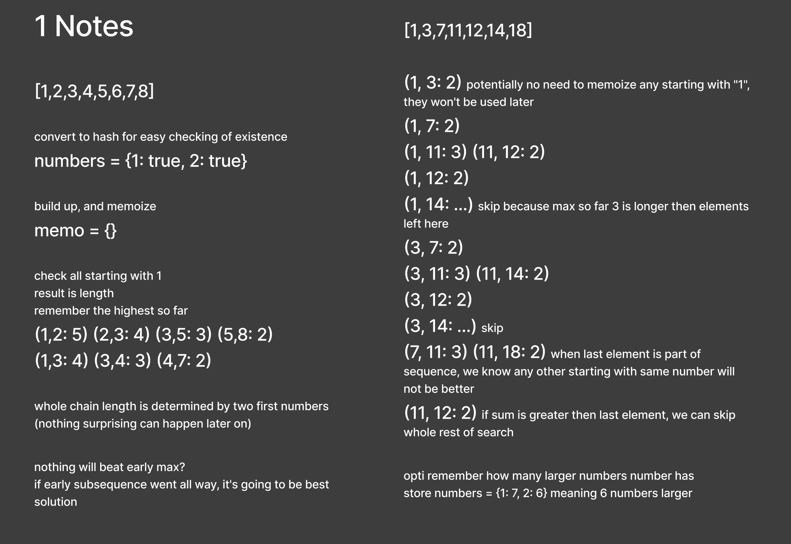
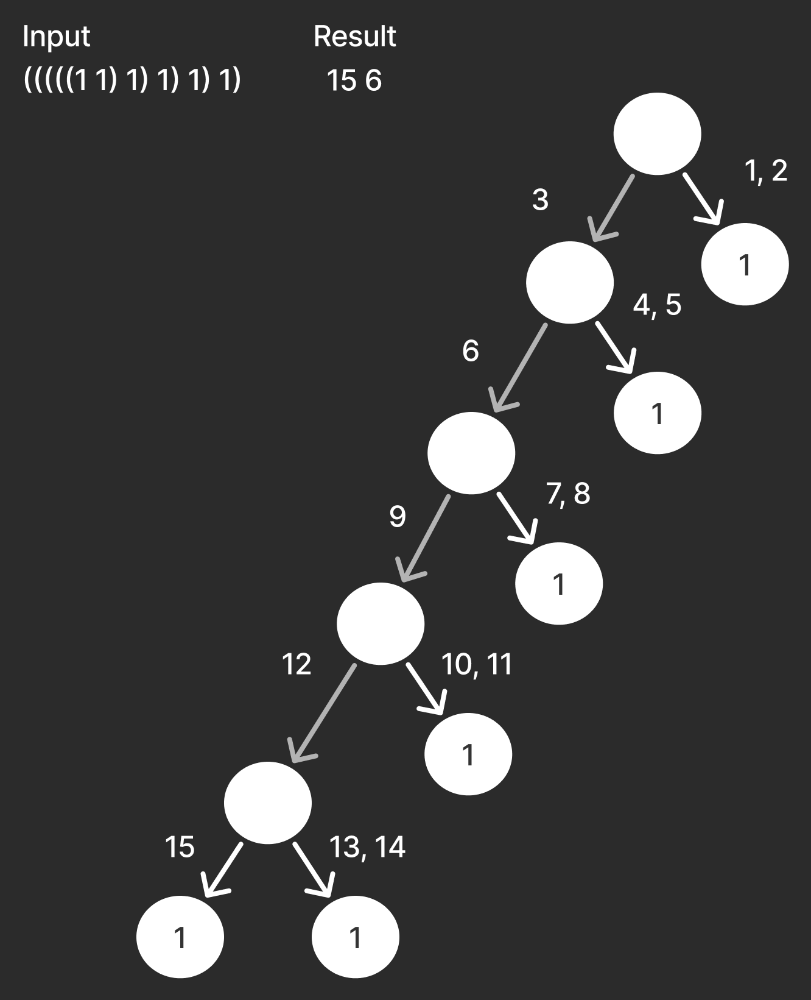
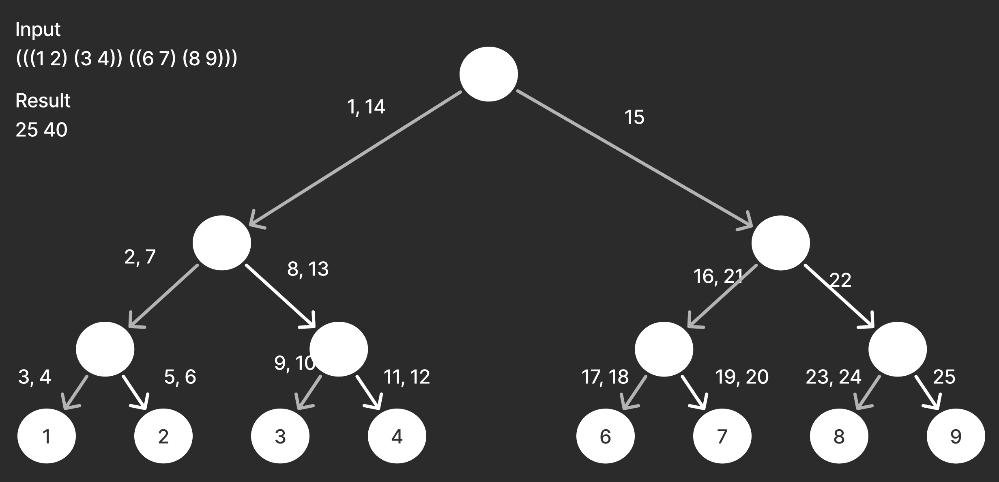

# Leet code solving  

2460. Apply Operations to an Array
[1092. Shortest Common Supersequence](https://github.com/maciej-ka/eat-code?tab=readme-ov-file#1092-shortest-common-supersequence)  
[873. Length of Longest Fibonacci Subsequence](https://github.com/maciej-ka/eat-code?tab=readme-ov-file#873-length-of-longest-fibonacci-subsequence)  
[1749. Maximum Absolute Sum of Any Subarray](https://github.com/maciej-ka/eat-code?tab=readme-ov-file#1749-maximum-absolute-sum-of-any-subarray)  
[1524. Number of Sub-arrays With Odd Sum](https://github.com/maciej-ka/eat-code?tab=readme-ov-file#1524-number-of-sub-arrays-with-odd-sum)  
[3399. Smallest Substring With Identical Characters II](#3399-smallest-substring-with-identical-characters-ii)  
[347. Top K Frequent Elements](#347-top-k-frequent-elements)  
[2834. Find the Minimum Possible Sum of a Beautiful Array](#2834-find-the-minimum-possible-sum-of-a-beautiful-array)  
[Trick or Tree'ing](#trick-or-treeing)  
[213. House Robber II](#213-house-robber-ii)  
[31. Next Permutation](#31-next-permutation)

#### Random problem
https://leetcode.com/problemset/  
and click "pick one"

#### Random lang
Feeling in a polyprogramming mood?  
Randomly pick language on leetcode.
```bash
./random-lang
```

[2460. Apply Operations to an Array](https://leetcode.com/problems/apply-operations-to-an-array/description/)
========================================

### Javascript
[solution](./2460/1-js/solution.js)  
[submission](https://leetcode.com/problems/apply-operations-to-an-array/submissions/1559030504/)  
37% (4ms)  
15% (56MB)


[1092. Shortest Common Supersequence](https://leetcode.com/problems/shortest-common-supersequence/description/)
==========================================

### Misread
Misread that strings have to be strictly sub strings  
and came up with solution on base of that wrong assumption  
[strict substring notes](./1092/wrong.md)

### Adjust
Corrected meaning of supersequence  


### Javascript
Dynamic programming  
Build solution step by step  
each time compare 3 possible ways to arrive  
and store the best one as step result  
[solution](./1092/1-js/solution.js)  
[submission](https://leetcode.com/problems/shortest-common-supersequence/submissions/1558091153/)  
7% (448ms)  
8% (115MB)

### Javascript
Try to improve by prepopulating solution array  
which allows to remove conditional statements  
from loop  
(it turned out to be worse)  
[solution](./1092/2-js/solution.js)  
[submission](https://leetcode.com/problems/shortest-common-supersequence/submissions/1558113727/)  
5% (526ms)  
5% (128MB)

### Optimized solution
Turns out creating strings, concatenating them  
and storing in every cell of dynamic programming step  
is really slow when compared to just storing a number.  
This solution stores both number and instruction how to build solution  
in one number, where last 2 bits are flag about direction  
then used to recreate solution string  

  


### Javascript
[solution](./1092/3-js/solution.js)  
[submission](https://leetcode.com/problems/shortest-common-supersequence/submissions/1558320298/)  
85% (55ms)  
52% (79MB)


[873. Length of Longest Fibonacci Subsequence](https://leetcode.com/problems/length-of-longest-fibonacci-subsequence/description/)
=================================================

  

### Javascript
quite brutal attempt,  
only added a hashmap for fast number lookup  
[solution](./873-fib-seq/1-js/solution.js)  
[submission](https://leetcode.com/problems/length-of-longest-fibonacci-subsequence/submissions/1557215286/)  
28% (273ms)  
25% (58MB)

### Javascript
less temporary variables, a little better on memory  
[solution](./873-fib-seq/2-js/solution.js)  
[submission](https://leetcode.com/problems/length-of-longest-fibonacci-subsequence/submissions/1557249559/)  
28% (271ms)  
40% (57MB)

### Javascript
use Set instead of hash  
when creating lookup of numbers that are present  
(it's actually a bit slower this way)  
[solution](./873-fib-seq/3-js/solution.js)  
[submission](https://leetcode.com/problems/length-of-longest-fibonacci-subsequence/submissions/1557311393/)  
22% (290ms)  
57% (56MB)


[1749. Maximum Absolute Sum of Any Subarray](https://leetcode.com/problems/maximum-absolute-sum-of-any-subarray/description/)
================================================

  
  

### Javascript
use running sum right, then left  
[solution](./1749-max-subarray/1-js/solution.js)  
[submission](https://leetcode.com/problems/maximum-absolute-sum-of-any-subarray/submissions/1556041963/)  
85% (2ms)  
19% (59MB)


### Javascript
optimization attempts: strip Math.max  
if running sum min point is positive skip, then  
skip checking of best negative expansion  
try to use same variables to save memory  
[solution](./1749-max-subarray/2-js/solution.js)  
[submission](https://leetcode.com/problems/maximum-absolute-sum-of-any-subarray/submissions/1556076257/)  
85% (2ms)  
15% (61MB)


[1524. Number of Sub-arrays With Odd Sum](https://leetcode.com/problems/number-of-sub-arrays-with-odd-sum/description/)
=============================================

  
  
  
  
  
  
  


### Javascript
[solution](./1524-odd-sum-subarrays/1-js/solution.js)  
[submission](https://leetcode.com/problems/number-of-sub-arrays-with-odd-sum/submissions/1555215005/)  
18% (13ms)  
7% (69MB)

### Javascript
Instead of array use linked list  
with one one traversal (back)  
[solution](./1524-odd-sum-subarrays/2-js/solution.js)  
[submission](https://leetcode.com/problems/number-of-sub-arrays-with-odd-sum/submissions/1555256955/)  
11% (19ms)  
7% (73MB)


[3399. Smallest Substring With Identical Characters II](https://leetcode.com/problems/smallest-substring-with-identical-characters-ii/description/)  
========================================================

  
  
  
  
  


### Javascript
[solution](./3399-shortest-identical-slice/1-js/solution.js)  
[submission](https://leetcode.com/problems/smallest-substring-with-identical-characters-ii/submissions/1543012089/)  
45% (54ms)  
34% (58MB)

### Javascript
Significantly speed up by converting to number with `~~` instead of `Number`.  
And use `Map` instead of `{}` as its faster for number keys. This one may not have visible impact.  
[solution](./3399-shortest-identical-slice/2-js/solution.js)  
[submission](https://leetcode.com/problems/smallest-substring-with-identical-characters-ii/submissions/1543534457/)  
82% (33ms)  
36% (57MB)

### Javascript
Speed up by not dividing by 2 but using bitshift `>> 1`  
[solution](./3399-shortest-identical-slice/3-js/solution.js)  
[submission](https://leetcode.com/problems/smallest-substring-with-identical-characters-ii/submissions/1543591573/)  
98% (23ms)  
85% (55MB)

### Ruby
Same approach  
[solution](./3399-shortest-identical-slice/4-rb/solution.rb)  
[submission](https://leetcode.com/problems/smallest-substring-with-identical-characters-ii/submissions/1551768163/)  
100% (607ms)  
100% (215MB)

### Elixir
Same approach  
[solution](./3399-shortest-identical-slice/5-ex/lib/solution.ex)  
[submission](https://leetcode.com/problems/smallest-substring-with-identical-characters-ii/submissions/1552746138/)  
100% (52ms)  
100% (95MB)


[347. Top K Frequent Elements](https://leetcode.com/problems/top-k-frequent-elements/description/)  
========================================================

### Count using hashmap
then convert to array and sort


### Javascript
[solution](./347-top-k-frequent/1-js/solution.js)  
[submission](https://leetcode.com/problems/top-k-frequent-elements/submissions/1532809469/)  
81% (10ms)  
95% (52MB)

### Javascript
Improve speed by using `new Map` instead of `{}`.  
Which saves time when keys are non strings (like in this case).  
[solution](./347-top-k-frequent/4-js/solution.js)  
[submission](https://leetcode.com/problems/top-k-frequent-elements/submissions/1538413476/)  
95% (6ms)  
95% (52MB)

### PHP
first PHP written after 15 years  
[solution](./347-top-k-frequent/2-php/src/Solution.php)  
[submission](https://leetcode.com/problems/top-k-frequent-elements/submissions/1538133077/)  
58% (2ms)  
7% (23MB)

### PHP
buckets of same count  
try to speed up sorting, by grouping values of same count  
*didn't improve speed,*  
*but suprisingly improved memory,*  
*even though it seems to use structures then before*  
[solution](./347-top-k-frequent/3-php/src/Solution.php)  
[submission](https://leetcode.com/problems/top-k-frequent-elements/submissions/1538257338/)  
58% (2ms)  
50% (22MB)


[2834. Find the Minimum Possible Sum of a Beautiful Array](https://leetcode.com/problems/find-the-minimum-possible-sum-of-a-beautiful-array/description/)  
========================================================


### Solvable by math?
idea that there is a mathematical solution  
and its just enough to do some maths  
and solve equation for area on discrete plane


### Check results


### Ruby
[solution](./2834-sum-beautiful/1-rb/solution.rb)  
[submission](https://leetcode.com/problems/find-the-minimum-possible-sum-of-a-beautiful-array/submissions/1434497907/)  
100% (2ms)   
100% (211MB)


[Trick or Tree'ing](https://dmoj.ca/problem/dwite12c1p4)  
========================================================

### Parse a tree
Parse string using stack and in result have an object tree.


### Poblems with "candy length"  
"Candy length" is taking into account that kids don't have to end on root node.


### Test cases







### Ruby
perhaps can be improved by not really creating nodes  
[solution](./dwite12c1p4/1-rb/solution.rb)  
[submission](https://dmoj.ca/submission/6695557)  
24ms  
11MB


[213. House Robber II](https://leetcode.com/problems/house-robber-ii/description/)  
========================================================


### Attempt
Dynamic programming, growing from left to right.


### Mistake attempt
Dynamic programming, growing in both directions.  
Always calculating as elements would be cycled.  
Which leads to mistakes in result when reusing previous results.


### More complex example


### Solution


### Ruby
first solution, more clear than others  
[solution](./213-robber/1-rb/solution.rb)  
[submission](https://leetcode.com/problems/house-robber-ii/submissions/1397543026/)  
42% (63ms)  
42% (221MB)  

### Ruby
Inlined. Probably better performance due to smaller call stack  
[solution](./213-robber/2-rb/solution.rb)  
[submission](https://leetcode.com/problems/house-robber-ii/submissions/1397630686/)  
100% (43ms)  
90% (211MB)  

### Ruby
Without Array max. Check would it improve to avoid calling max on temporary arrays  
(it didn't)  
[solution](./213-robber/3-rb/solution.rb)  
[submision](https://leetcode.com/problems/house-robber-ii/submissions/1397606332/)  
42% (63ms)  
90% (211MB)  

### Top-bottom
Sketch of calcutating from top to bottom.  
With recursion and memoization.


### Elixir
Recursive and memoized. Top-bottom, memoization to prevent exponential grow of recursive calls  
[solution](./213-robber/4-ex/lib/solution.ex)  
[submission](https://leetcode.com/problems/house-robber-ii/submissions/1400044490/)  
100% (1ms)  
100% (72MB)  

### Elixir
Memo in stateful process. Memo moved from parameter to Agent, better readibility at a cost of performance  
[solution](./213-robber/5-ex/lib/solution.ex)  
[submission](https://leetcode.com/problems/house-robber-ii/submissions/1404058373/)  
50% (21ms)  
50% (74MB)  


[31. Next Permutation](https://leetcode.com/problems/next-permutation/description/)  
========================================================

### C
[solution](./31-next-perm/1.c)  
[submission](https://leetcode.com/problems/next-permutation/submissions/1260043065/)  
2% (3ms)  
100% (6.2MB)  
