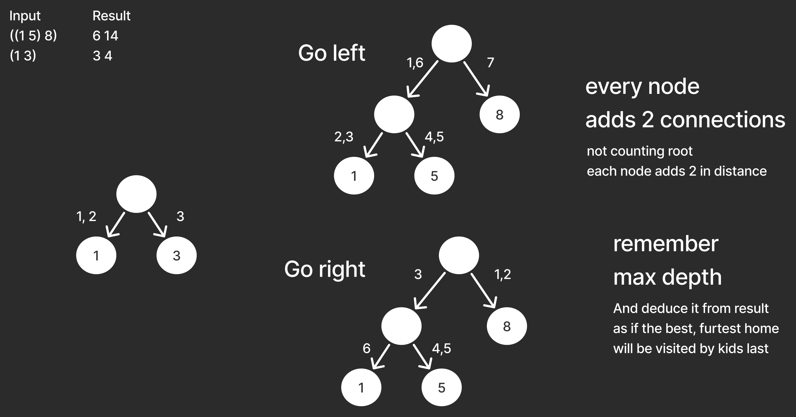
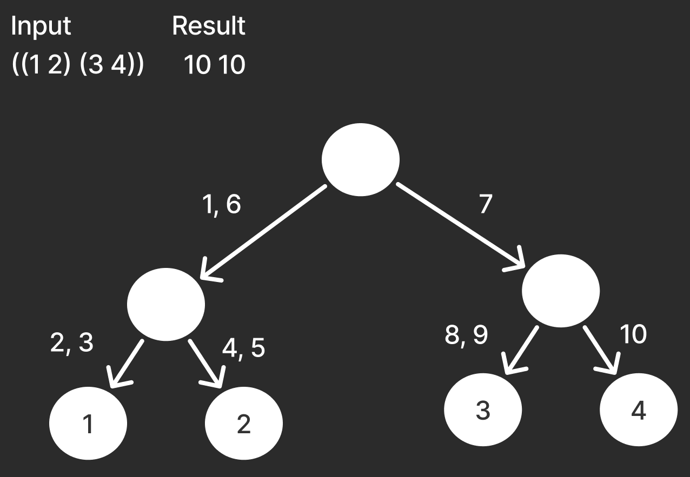

# Leet code solving  
[347. Top K Frequent Elements](#347-top-k-frequent-elements)  
[2834. Find the Minimum Possible Sum of a Beautiful Array](#2834-find-the-minimum-possible-sum-of-a-beautiful-array)

## [347. Top K Frequent Elements](https://leetcode.com/problems/top-k-frequent-elements/description/)

#### Count using hashmap
then convert to array and sort

#### 1. Javascript
[solution](./347-top-k-frequent/1-js/solution.js)  
[submission](https://leetcode.com/problems/top-k-frequent-elements/submissions/1532809469/)  
10ms (81.57%)  
52.17MB (95.30%)

## [2834. Find the Minimum Possible Sum of a Beautiful Array](https://leetcode.com/problems/find-the-minimum-possible-sum-of-a-beautiful-array/description/)

#### Solvable by math?
idea that there is a mathematical solution  
and its just enough to do some maths  
and solve equation for area on discrete plane

#### Check results

#### 1. Ruby
[solution](./2834-sum-beautiful/1-rb/solution.rb)  
[submission](https://leetcode.com/submissions/detail/1397630686/)  
2ms (100%)  
211.4MB (100%)

## Trick or Tree'ing
https://dmoj.ca/problem/dwite12c1p4

#### Parse a tree
Parse string using stack and in result have an object tree.

# Poblems with "candy length"  
"Candy length" is taking into account that kids don't have to end on root node.

# Test cases

#### 1. Ruby
perhaps can be improved by not really creating nodes  
[solution](./dwite12c1p4/1-rb/solution.rb)  
[submission](https://dmoj.ca/submission/6695557)  
0.024s  
11.16 MB

## 213 robber
https://leetcode.com/problems/house-robber-ii/description/

#### Solving
[solution ideas](./213-robber/solving.md) 

#### Ruby
[1. unoptimized](./213-robber/1-rb/solution.rb)   
first solution, more clear than others   
  
[submission](https://leetcode.com/submissions/detail/1397543026/)   
63ms (41.94%)   
221MB (41.94%)  

[2. inlined](./213-robber/2-rb/solution.rb)   
probably better performance due to smaller call stack   
  
[submission](https://leetcode.com/submissions/detail/1397630686/)   
43ms (100%)   
211MB (90.32%)  

[3. without Array.max](./213-robber/3-rb/solution.rb)   
check would it improve to avoid calling max on temporary arrays   
(it didn't)   
  
[submision](https://leetcode.com/submissions/detail/1397606332/)   
63ms (41.94%)   
211MB (90.32%)  

#### Elixir
[1. recursive and memoized](./213-robber/4-ex/lib/solution.ex)   
top-bottom, memoization to prevent exponential grow of recursive calls   
  
[submission](https://leetcode.com/submissions/detail/1400044490/)   
1ms (100%)   
72MB (100%)  

[2. memo in stateful process](./213-robber/5-ex/lib/solution.ex)   
memo moved from parameter to Agent, better readibility at a cost of performance   
  
[submission](https://leetcode.com/submissions/detail/1404058373/)   
21ms (50%)   
74MB (50%)  

